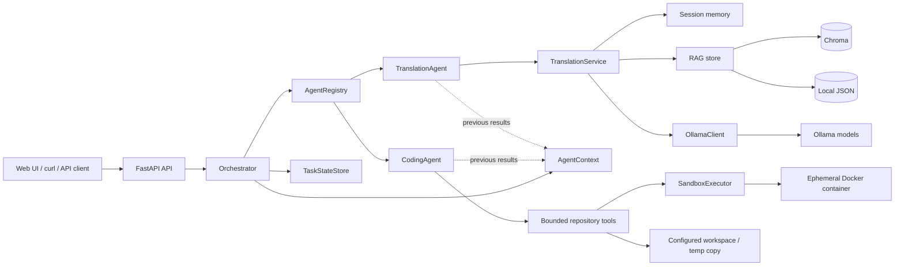

# Agent Workbench

A centralized multi-agent workbench using `FastAPI` and a local `Ollama` model
(default: `qwen2.5:3b`). Translation and coding are built-in workers, and new
specialized agents can be registered without coupling them to one another.

## Features

- Session memory (multi-turn translation context)
- Style and domain control (`neutral`, `formal`, `technical`, etc.)
- Glossary control (`source_term=target_term`)
- RAG knowledge base with pluggable storage (`chroma` or `local_json`)
- Centralized Orchestrator with TranslationAgent and CodingAgent workers
- Web UI + API endpoints

## Architecture

The system follows a centralized Orchestrator pattern: the API submits a task
to the Orchestrator, the Orchestrator routes it through the AgentRegistry, and
specialized workers execute their own domain tools. Workers do not call one
another directly; later workers receive prior results through `AgentContext`.



## 1. Prerequisites

- Python 3.10+
- Ollama installed and running
- Model available locally:

```powershell
ollama pull qwen2.5:3b
ollama pull nomic-embed-text
```

## 2. Local setup (Windows)

```powershell
python -m venv .venv
.\.venv\Scripts\Activate.ps1
pip install -r requirements.txt
Copy-Item .env.example .env
```

## 3. Linux deployment

The following example targets Ubuntu/Debian and installs the service under
`/opt/agent-workbench`. It uses a dedicated system user, a Python virtual
environment, local Ollama, and systemd.

### 3.1 Install OS dependencies

```bash
sudo apt update
sudo apt install -y git curl python3 python3-venv python3-pip docker.io
sudo systemctl enable --now docker
```

### 3.2 Install and prepare Ollama

Install Ollama using its official installer if it is not already installed:

```bash
curl -fsSL https://ollama.com/install.sh | sh
sudo systemctl enable --now ollama
ollama pull qwen2.5:3b
ollama pull nomic-embed-text
```

Keep Ollama bound to localhost unless you explicitly need remote model access.
Do not expose port `11434` directly to the public internet.

### 3.3 Install Agent Workbench

```bash
if ! id -u agentworkbench >/dev/null 2>&1; then
  sudo useradd --system --home-dir /opt/agent-workbench \
    --shell /usr/sbin/nologin agentworkbench
fi

sudo git clone https://github.com/hanwang66/agent-workbench.git /opt/agent-workbench
sudo chown -R agentworkbench:agentworkbench /opt/agent-workbench

sudo -u agentworkbench python3 -m venv /opt/agent-workbench/.venv
sudo -u agentworkbench /opt/agent-workbench/.venv/bin/python \
  -m pip install --upgrade pip
sudo -u agentworkbench /opt/agent-workbench/.venv/bin/python \
  -m pip install -r /opt/agent-workbench/requirements.txt

sudo docker build -f /opt/agent-workbench/Dockerfile.sandbox \
  -t agent-workbench-sandbox:py312 /opt/agent-workbench
```

The systemd service user must be able to invoke the Docker daemon. For a
trusted single-host installation this can be configured with `sudo usermod -aG
docker agentworkbench`, followed by a service restart. Membership in the
`docker` group grants broad control over the Docker daemon; use a separate
rootless runner service instead for untrusted or multi-tenant workloads.

### 3.4 Configure the environment

```bash
sudo -u agentworkbench cp \
  /opt/agent-workbench/.env.example /opt/agent-workbench/.env
sudo -u agentworkbench nano /opt/agent-workbench/.env
```

For a local-only service, keep or set these values:

```env
HOST=127.0.0.1
PORT=8000
OLLAMA_BASE_URL=http://127.0.0.1:11434
OLLAMA_MODEL=qwen2.5:3b
OLLAMA_EMBED_MODEL=nomic-embed-text
RAG_BACKEND=chroma
CHROMA_PERSIST_DIRECTORY=/opt/agent-workbench/data/chroma
CODING_WORKSPACE_ROOT=/opt/agent-workbench
```

Create the writable data directory before starting systemd:

```bash
sudo install -d -o agentworkbench -g agentworkbench \
  /opt/agent-workbench/data
```

### 3.5 Run with systemd

Create `/etc/systemd/system/agent-workbench.service`:

```ini
[Unit]
Description=Agent Workbench API
After=network-online.target ollama.service docker.service
Wants=network-online.target

[Service]
Type=simple
User=agentworkbench
Group=agentworkbench
WorkingDirectory=/opt/agent-workbench
EnvironmentFile=/opt/agent-workbench/.env
Environment=PYTHONUNBUFFERED=1
ExecStart=/opt/agent-workbench/.venv/bin/uvicorn app.main:app --host 127.0.0.1 --port 8000
Restart=on-failure
RestartSec=5
NoNewPrivileges=true
PrivateTmp=true
ProtectHome=true

[Install]
WantedBy=multi-user.target
```

Enable and start the service:

```bash
sudo systemctl daemon-reload
sudo systemctl enable --now agent-workbench
sudo systemctl status agent-workbench
```

### 3.6 Verify and operate

```bash
curl -fsS http://127.0.0.1:8000/health
curl -fsS http://127.0.0.1:8000/agents
curl -fsS http://127.0.0.1:8000/health/ready
sudo journalctl -u agent-workbench -f
```

`/health/ready` requires both configured Ollama models to be available. For a
reverse-proxy deployment, put Nginx or Caddy in front of `127.0.0.1:8000` and
terminate TLS there; keep the application and Ollama ports private.

To update an existing installation:

```bash
sudo -u agentworkbench git -C /opt/agent-workbench pull --ff-only
sudo -u agentworkbench /opt/agent-workbench/.venv/bin/python \
  -m pip install -r /opt/agent-workbench/requirements.txt
sudo systemctl restart agent-workbench
```

Back up `/opt/agent-workbench/data/` when using persistent RAG data.

## 4. Run API

```powershell
uvicorn app.main:app --reload --host 127.0.0.1 --port 8000
```

Open docs: `http://127.0.0.1:8000/docs`
Open web UI: `http://127.0.0.1:8000`

## 4.1 Agent Orchestrator

The project exposes a centralized orchestrator while keeping the original
`/translate` endpoint backward-compatible:

- `GET /agents`: list registered worker agents and capabilities.
- `POST /agent/run`: route a task to a registered worker.
- `GET /agent/tasks/{task_id}`: inspect the in-memory orchestration state.
- `POST /translate`: compatibility endpoint backed by `TranslationAgent`.

The built-in `CodingAgent` is read-only by default. It can list and search
files, read text, inspect `git diff`, and run the fixed unittest/diff checks.
Validation commands run in an ephemeral Docker sandbox with no network,
read-only root filesystem, dropped capabilities, a non-root UID, and CPU,
memory, process, timeout, and output limits. Build the sandbox image before
using `run_tests` or `get_git_diff`:

```bash
docker build -f Dockerfile.sandbox -t agent-workbench-sandbox:py312 .
```

All CodingAgent tools operate on a sanitized temporary snapshot. Host virtual
environments, runtime data, environment files, SSH material, private-key
files, and Git credentials are excluded from that snapshot. When
`parameters.write_approved=true`, `write_file` is exposed only inside the
temporary copy. The real repository is never modified; completed changes are
returned as an unapplied unified-diff artifact and the task enters
`waiting_approval` for a separate approval/apply workflow.

Example:

```json
{
  "task": "Translate this release note into Chinese",
  "agent_type": "translation",
  "parameters": {
    "source_lang": "English",
    "target_lang": "Chinese",
    "use_rag": true
  }
}
```

The current release includes `TranslationAgent`. New workers should implement
the shared Agent interface and be registered in `AgentRegistry`; this keeps
worker-specific tools and context isolated from the orchestrator.

For an explicit multi-step plan, pass `parameters.plan`:

```json
{
  "task": "Inspect and translate the result",
  "parameters": {
    "plan": [
      {"agent_type": "coding", "task": "Inspect the repository", "parameters": {}},
      {"agent_type": "translation", "task": "Translate the inspection summary", "parameters": {}}
    ]
  }
}
```

When a later step is a `TranslationAgent`, preceding worker output is included
by default. Set `include_previous_results` to `false` on that step to keep it
independent.

The initial state store is in memory. It is intentionally behind `TaskStateStore`
so a later release can use SQLite or PostgreSQL for resumable execution.

## 5. Test Translation

```powershell
curl -X POST "http://127.0.0.1:8000/translate" `
  -H "Content-Type: application/json" `
  -d '{"text":"你好，世界","source_lang":"Chinese","target_lang":"English"}'
```

Expected response shape:

```json
{
  "translated_text": "Hello, world!",
  "model": "qwen2.5:3b",
  "source_lang": "Chinese",
  "target_lang": "English"
}
```

Advanced payload example:

```json
{
  "text": "这个模型的上下文窗口很大",
  "source_lang": "Chinese",
  "target_lang": "English",
  "knowledge_base_id": "project-alpha",
  "session_id": "demo-session-1",
  "style": "formal",
  "domain": "technical",
  "use_rag": true,
  "use_function_calling": true,
  "rag_top_k": 3,
  "rag_filter": {
    "knowledge_base_id": "project-alpha",
    "source": "manual",
    "language": "zh",
    "tags": ["terminology"]
  },
  "glossary": {
    "上下文窗口": "context window",
    "模型": "model"
  }
}
```

Advanced response fields:

- `session_id`: Active memory session ID
- `memory_turns`: Number of turns kept in memory
- `rag_used`: Whether retrieval returned usable chunks
- `rag_chunks`: Retrieved chunk labels used in prompt
- `use_function_calling=true`: uses Ollama `/api/chat` with tool-calling (`get_rag_context`) instead of pure prompt mode
- `tool_traces`: Structured tool execution traces (`executed`/`blocked`/`error`) for auditing

Function-calling controls:

- Multi-round tool loop is enabled in function-calling mode.
- Whitelisted tools only (`FUNCTION_CALL_ALLOWED_TOOLS`).
- Hard limits for rounds and tool calls (`FUNCTION_CALL_MAX_ROUNDS`, `FUNCTION_CALL_MAX_TOOL_CALLS`).

## 6. Session APIs

- `GET /sessions/{session_id}`: check memory turn count
- `DELETE /sessions/{session_id}`: clear session memory

Health APIs:

- `GET /health`: basic liveness
- `GET /health/ready`: readiness check for `OLLAMA_MODEL` and `OLLAMA_EMBED_MODEL`

## 7. RAG APIs

- `POST /rag/documents`: ingest one document into local persistent vector store
- `POST /rag/documents/upload`: upload a text file and ingest into vector store
- `GET /rag/documents`: list current ingested documents (supports `source`/`language`/`tag` filters)
- `DELETE /rag/documents/{doc_id}`: delete one RAG document
- `DELETE /rag/documents`: clear all RAG documents

Deduplication behavior:

- Document-level dedup: same document text in the same `knowledge_base_id` is rejected.
- Chunk-level dedup: repeated chunks are skipped (both duplicates within request and duplicates already in the same knowledge base).

Ingest example:

```json
{
  "title": "Product Glossary",
  "text": "RAG stands for Retrieval-Augmented Generation. Context window is the token span the model can see.",
  "knowledge_base_id": "project-alpha",
  "source": "manual",
  "tags": ["terminology", "nlp"],
  "language": "en"
}
```

Upload example (PowerShell):

```powershell
curl -X POST "http://127.0.0.1:8000/rag/documents/upload" `
  -F "title=Product Glossary" `
  -F "knowledge_base_id=project-alpha" `
  -F "source=upload" `
  -F "tags=terminology,nlp" `
  -F "language=en" `
  -F "file=@./docs/glossary.txt"
```

Document list filter example:

```powershell
curl "http://127.0.0.1:8000/rag/documents?knowledge_base_id=project-alpha&source=manual&language=en&tag=terminology"
```

Web UI now supports selecting a local file and clicking `上传并入库`.

## 8. Config

Edit `.env`:

- `OLLAMA_BASE_URL` default `http://127.0.0.1:11434`
- `OLLAMA_MODEL` default `qwen2.5:3b`
- `OLLAMA_EMBED_MODEL` default `nomic-embed-text`
- `OLLAMA_TEMPERATURE` default `0.1`
- `OLLAMA_TIMEOUT_SECONDS` default `60`
- `OLLAMA_MAX_RETRIES` default `2`
- `OLLAMA_RETRY_BACKOFF_SECONDS` default `0.5`
- `MAX_SESSION_TURNS` default `6`
- `MAX_SESSIONS` default `10000` (maximum in-memory sessions)
- `SESSION_TTL_SECONDS` default `3600` (inactive session expiry; `0` disables TTL)
- `RAG_CHUNK_SIZE` default `500`
- `RAG_CHUNK_OVERLAP` default `80`
- `RAG_BACKEND` default `chroma` (`chroma` or `local_json`)
- `RAG_STORE_PATH` default `data/rag_store.json` (used when `RAG_BACKEND=local_json`)
- `CHROMA_PERSIST_DIRECTORY` default `data/chroma` (used when `RAG_BACKEND=chroma`)
- `CHROMA_COLLECTION_NAME` default `translation_rag` (used when `RAG_BACKEND=chroma`)
- `RETRIEVAL_MODE` default `hybrid` (`vector` / `bm25` / `hybrid`)
- `HYBRID_VECTOR_WEIGHT` default `0.6`
- `HYBRID_BM25_WEIGHT` default `0.4`
- `HYBRID_RRF_K` default `60`
- `HYBRID_CANDIDATE_MULTIPLIER` default `4`
- `FUNCTION_CALL_MAX_ROUNDS` default `4`
- `FUNCTION_CALL_MAX_TOOL_CALLS` default `4`
- `FUNCTION_CALL_ALLOWED_TOOLS` default `get_rag_context`
- `CODING_SANDBOX_ENABLED` default `true`; set `false` only for trusted local development
- `CODING_SANDBOX_IMAGE` default `agent-workbench-sandbox:py312`
- `CODING_SANDBOX_DOCKER_BINARY` default `docker`
- `CODING_SANDBOX_CPUS` default `1.0`
- `CODING_SANDBOX_MEMORY` default `512m`
- `CODING_SANDBOX_PIDS_LIMIT` default `128`
- `CODING_SANDBOX_OUTPUT_BYTES` default `65536`
- `CODING_SANDBOX_TMPFS_SIZE` default `64m`
- `MAX_UPLOAD_SIZE_BYTES` default `2097152` (2MB)
- `UPLOAD_ALLOWED_EXTENSIONS` default `.txt,.md,.csv,.log`
- `HOST` and `PORT` for your API runtime settings

Persistence notes:

- `chroma` backend persists vectors in `CHROMA_PERSIST_DIRECTORY`.
- `local_json` backend persists data in `RAG_STORE_PATH`.

Sandbox notes:

- The Docker daemon and image are deployment prerequisites for the default
  CodingAgent configuration.
- Do not mount `/var/run/docker.sock` into the API container or allow callers
  to provide arbitrary Docker flags, images, mounts, or commands.
- For untrusted multi-tenant workloads, run the sandbox executor as a separate
  rootless worker service and consider a stronger VM-backed isolation boundary.

## 9. Chroma Quick Start

1. Keep `.env` values:

```env
RAG_BACKEND=chroma
CHROMA_PERSIST_DIRECTORY=data/chroma
CHROMA_COLLECTION_NAME=translation_rag
```

2. Start service and ingest documents via UI or `/rag/documents`.
3. Query `/translate` with `use_rag=true`.

Hybrid retrieval notes:

- `vector`: pure embedding similarity.
- `bm25`: pure lexical BM25 retrieval.
- `hybrid`: weighted RRF fusion of BM25 and vector results.

Per-request override example:

```json
{
  "text": "该系统支持大模型的本地部署",
  "source_lang": "Chinese",
  "target_lang": "English",
  "use_rag": true,
  "rag_top_k": 3,
  "retrieval_mode": "hybrid"
}
```
